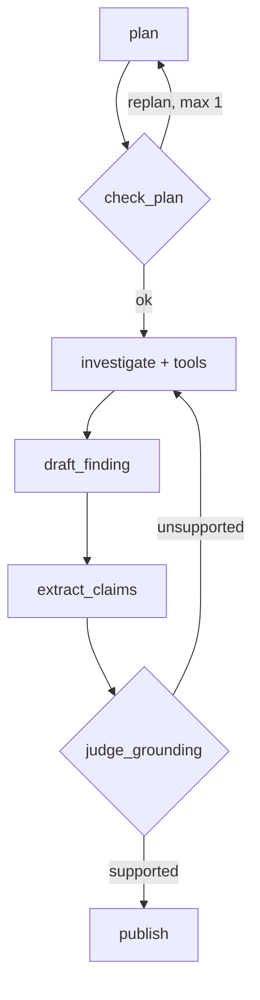

# Architecture overview

!!! info "In one paragraph, for a non-engineer"
    The system is a small pipeline: plan the investigation, check the plan makes
    sense, gather evidence with a fixed set of tools, draft a conclusion, check
    that conclusion against the evidence, and only then show it to you.

See [docs/PLAN.md](https://github.com/PLACEHOLDER/trade-surveillance-agent/blob/main/docs/PLAN.md)
§5 for the full design and the reasoning behind each decision. Architecture
decision records land in Phase 8; this page grows alongside the implementation
phases.

## API and persistence

`POST /investigations` starts one run as an in-process background task and
returns immediately; `GET /investigations/{id}` and
`GET /investigations/{id}/events` read from `RunStore` (SQLite,
`data/runs.db`) — every node event, the terminal finding, and per-node LLM
cost are persisted as the run executes, so a run is replayable from the store
whether a client is watching live or reconnects after the fact. See
[api.md](../api.md) for the generated reference.

