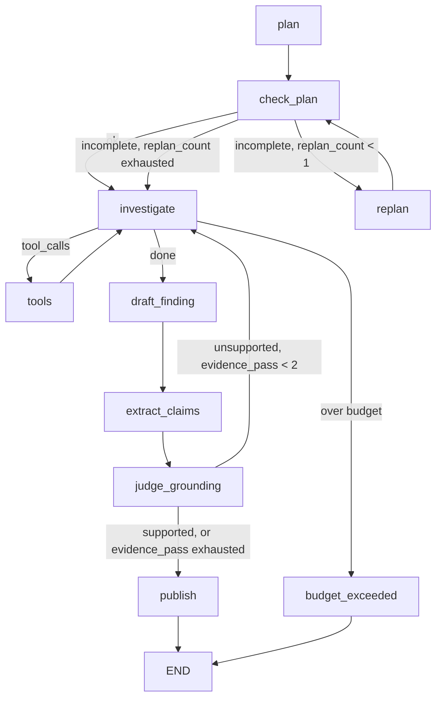

# State and flow

## The state object

`SurveillanceState` (`src/surveillance/graph/state.py`) is a `TypedDict` threaded
through every node in the graph:

| Field | Type | Purpose |
|---|---|---|
| `messages` | `Annotated[Sequence[BaseMessage], add_messages]` | The investigator's conversation with the tool-calling model; append-only via LangGraph's `add_messages` reducer. |
| `accession_number` | `str` | The SEC Form 4 filing under investigation. |
| `plan` | `InvestigationPlan \| None` | The planner's proposed tool-call sequence. |
| `plan_check` | `PlanCheck \| None` | Deterministic validation result for `plan` (never LLM-authored). |
| `replan_count` | `int` | Bounded retry counter for the planning loop. |
| `started_at` | `float` | Wall-clock start time, used for the budget guardrail. |
| `draft_finding` | `ComplianceFinding \| None` | The investigator's conclusion, plus deterministically-derived exculpatory factors. |
| `claims` | `list[Claim]` | The draft finding's `finding_text` decomposed into discrete, tool_call_id-cited claims. |
| `grounding_report` | `GroundingReport \| None` | Per-claim judgments plus the deterministically-aggregated `unsupported` count and `confidence`. |
| `evidence_pass` | `int` | Bounded retry counter for the grounding loop. |
| `published_finding` | `PublishedFinding \| None` | The terminal artifact: the judged draft plus its grounding report, assembled with no model call. |

`create_initial_state(accession_number)` builds the starting state for a run.

## Graph flow

## Three bounded loops

1. **Planning loop** (`plan` → `check_plan` → `replan` → `check_plan` → ...).
   `check_plan` is a deterministic node (`check_plan.py`) — it verifies the
   plan calls `get_transaction_details` first and covers every mandatory tool
   in `MANDATORY_TOOLS`. Per D-A2-2 ("plan once, validate in code"), only one
   LLM call produces the plan; validation and replanning-feedback text are
   both plain code. `replan_count` is capped at `MAX_REPLANS = 1`
   (`graph/edges.py`) — after one failed replan, the graph proceeds to
   `investigate` anyway rather than looping forever.

2. **Investigation loop** (`investigate` ⇄ `tools`). The investigator model
   requests tool calls, `ToolNode` executes them against the real SQLite
   stores, and results feed back into `investigate`. `route_after_agent`
   (`graph/edges.py`) checks the real default `Budget`
   (`graph/budget.py`, `max_tool_calls=15`, `max_wall_clock_seconds=120.0`)
   on every turn and routes to `budget_exceeded` — which emits an
   `incomplete=True`, `disposition="escalate"` finding — rather than letting
   the loop run away.

3. **Grounding loop** (`draft_finding` → `extract_claims` → `judge_grounding` →
   back to `investigate`, or on to `publish`). See
   [How it works → Grounding](../how-it-works/grounding.md) for the full design.
   `evidence_pass` is capped at `MAX_EVIDENCE_PASSES = 2`
   (`graph/edges.py`) — once the cap is reached, the run publishes anyway
   rather than looping forever, with whatever stayed unsupported visible in
   the published `grounding_report`.

## Deterministic evidence, not model-authored

`graph/evidence.py` turns the raw `AIMessage`/`ToolMessage` pairs in
`messages` into typed `ToolCallRecord`s (`extract_tool_call_records`) and
derives `ExculpatoryFactor`s from them (`derive_exculpatory_factors`) —
e.g. `reported_under_10b5_1`, `tax_withholding` (transaction code `F`),
`option_exercise` (code `M`), and `below_all_thresholds`. This is deliberately
code, not an LLM call: "don't spend a model call on a decision an `if` can
make" (docs/PLAN.md). `draft_finding.py` attaches these factors to the LLM's
narrative `ComplianceFindingDraft` to produce the final `ComplianceFinding`.

The same discipline applies to the grounding loop: `judge_grounding.py`'s LLM
call only scores each individual claim as supported or not; the `unsupported`
count and the resulting `confidence` are computed afterwards in plain code,
never authored by the model.

