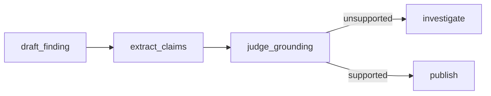

# Grounding

!!! info "In one paragraph, for a non-engineer"
    Before this system tells you its conclusion, it checks its own homework:
    every sentence in the draft finding is compared against the actual evidence
    it retrieved, and if a sentence isn't backed by anything real, the draft is
    thrown out and the investigation keeps digging — up to two extra tries.

## Why the draft is judged, not the final answer

An earlier design ran the grounding judge *before* a separate model wrote the
finding a user actually sees — so a passing grounding check said nothing about
the words that got published. That defeats the point of grounding at all. This
system instead judges the finding text itself:

1. **`draft_finding`** (LLM) writes a complete candidate finding from the
   evidence gathered so far.
2. **`extract_claims`** (LLM) decomposes that *exact* draft's `finding_text`
   into discrete claims, each citing the `tool_call_id`s it believes support it
   — never inventing an id that wasn't actually called.
3. **`judge_grounding`** (LLM, scored per claim) checks each claim against the
   real recorded tool results. The aggregate `unsupported` count and the
   resulting `confidence` are computed afterwards in plain code, not by the
   model — the judge scores claims, code counts them.
4. On a failure, the draft is discarded and the run returns to `investigate`
   with the specific unsupported claims as feedback, not a generic retry —
   capped at two extra evidence-gathering passes (`evidence_pass ≤ 2`).
5. **`publish`** contains no model call. It assembles the terminal
   `PublishedFinding` from the judged draft's own data plus the grounding
   report — so the text a user reads is provably the text that was judged,
   never rewritten afterward.

## Unsupported claims per grounding pass

<figure markdown>

<figcaption markdown>Unsupported claim count falling across evidence passes</figcaption>
</figure>

This chart is generated by actually running the production
`build_judge_grounding_node` code (`docs/generate_plots.py`,
`grounding_loop_unsupported_claims()`) through a scripted three-pass run — a
real investigation whose evidence improves each pass, judged by the real
deterministic aggregation logic. It uses a scripted stand-in for the live
grounding-judge model, since this deployment has no LLM API key configured for
chart generation; the mechanism it demonstrates — evidence_pass rising as
unsupported claims fall, capped at 2 — is exactly what `tests/graph/
test_surveillance_graph_integration.py` exercises end to end against the real
graph.

## What this catches, and what it doesn't

Grounding checks that a claim is backed by a tool result the run actually
retrieved — it does not re-verify that the tool result itself is correct, and
it does not check the *compliance conclusion* is right, only that the sentence
asserting it points at real evidence. A well-grounded finding can still be
wrong if the underlying data or rule table is wrong; that is why every
published finding carries a prototype disclaimer and a human stays in the
loop (see [Regulatory basis](../regulatory-basis.md)).
