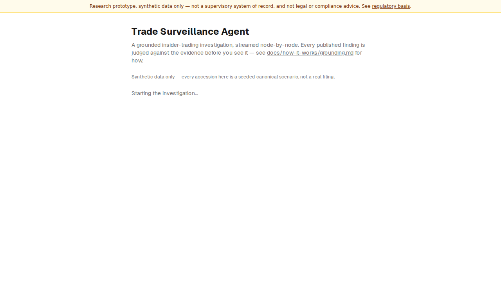
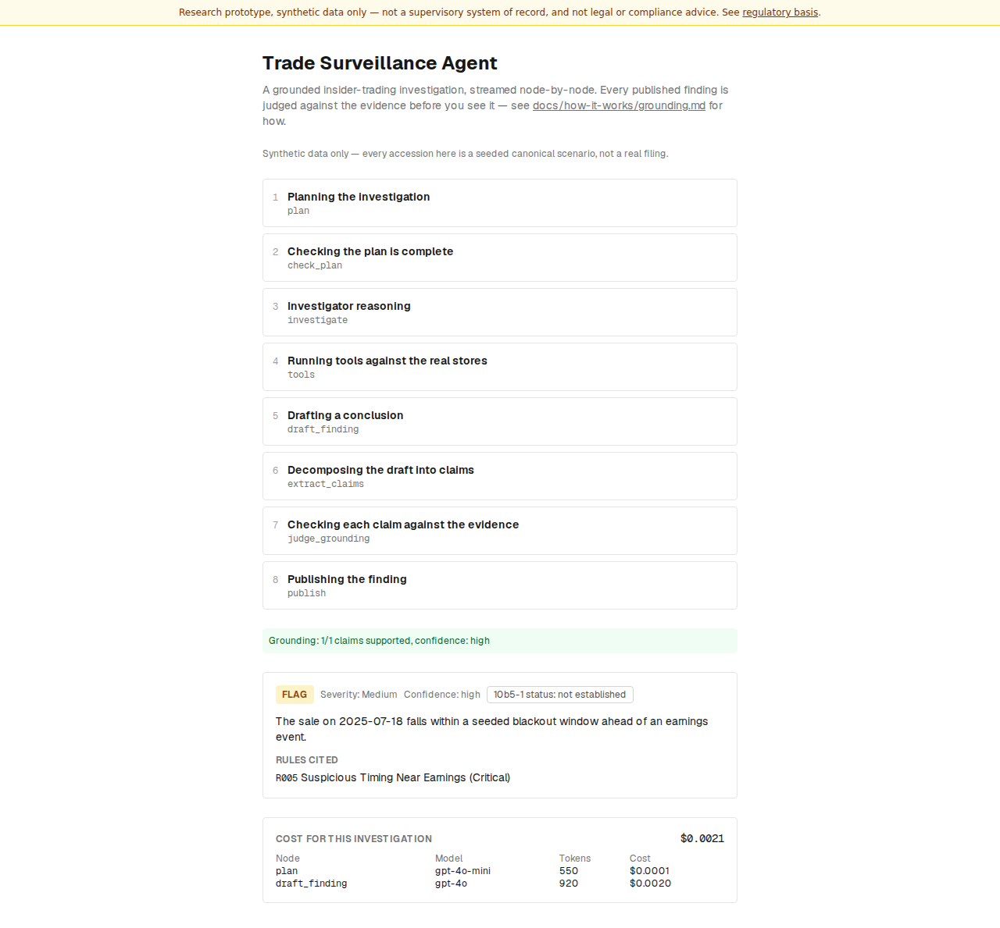
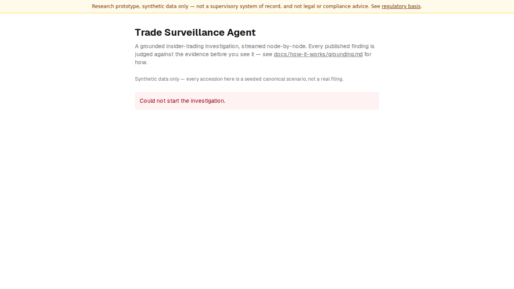
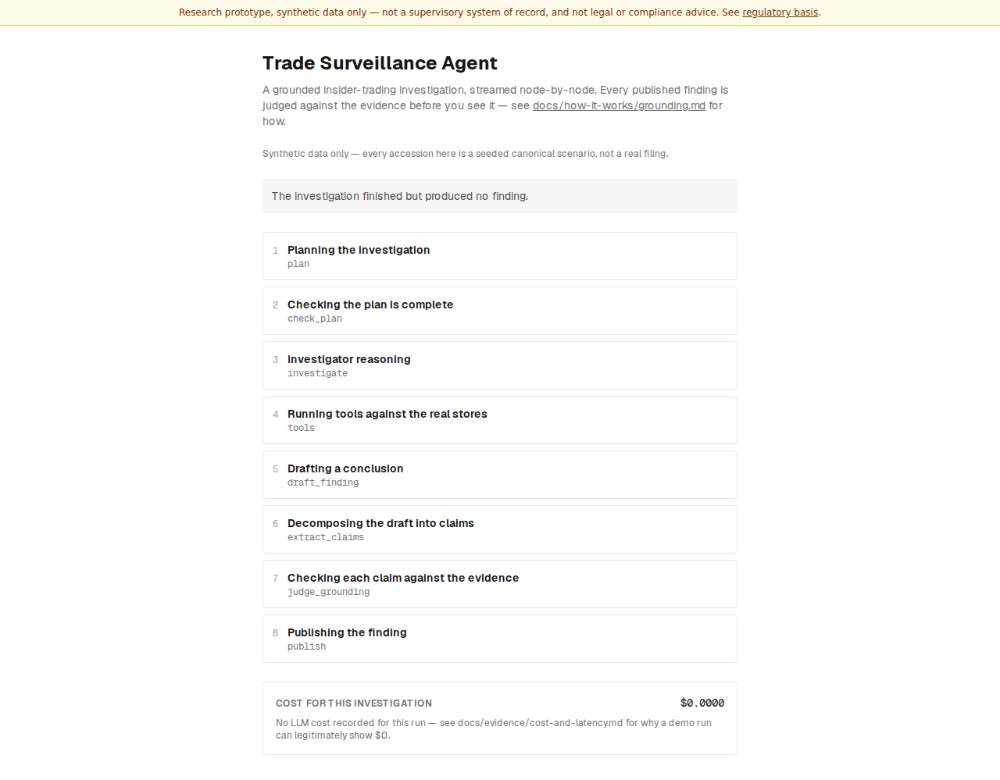

# The investigation, step by step

!!! info "In one paragraph"
    The screenshots below are the real UI, captured automatically
    (`make docs-screenshots`) against the same network-level mocks the
    Playwright smoke test uses — never hand-edited, so they can't drift from
    what the UI actually renders.

## What a visitor sees, without typing anything

The moment the page loads, `RunConsole` starts a real investigation against
a preloaded example accession and streams it node-by-node — "first paint
first" (docs/PLAN.md §7 Phase 6): no button, no form, no accession number to
type in.

### 1. Starting

<figure markdown>

<figcaption markdown>An investigation begins streaming automatically on page load</figcaption>
</figure>

### 2. The trace, streaming node by node

Each step in the graph — `plan`, `check_plan`, `investigate`, `tools`,
`draft_finding`, `extract_claims`, `judge_grounding`, `publish` — appears in
`TraceTimeline` the moment it completes.

### 3. The grounding check

Before the finding renders, `ValidatorStrip` shows whether the draft's
claims were actually supported by the evidence gathered — the same check
described in [Grounding](grounding.md).

### 4. The published finding

`EvidencePanel` renders the disposition, severity, confidence, the rules
cited, any exculpatory factors, and the `reported_under_10b5_1` tri-state —
rendered as "not established" for `unknown`, never as an absence of a plan
(D-A2-5). `CostMeter` shows what the investigation cost.

<figure markdown>

<figcaption markdown>A published finding, with its full grounding report</figcaption>
</figure>

## When it doesn't go as planned

Two more states the UI handles explicitly, both tested by the same
Playwright suite (`frontend/e2e/investigation.spec.ts`):

**A run that can't be started** — the backend is unreachable, over its rate
limit, or the request is rejected:

<figure markdown>

<figcaption markdown>A run that could not be started</figcaption>
</figure>

**A completed run with no finding** — a defensive case the pipeline
shouldn't reach in practice (`draft_finding` and `budget_exceeded` both
always produce a finding), rendered explicitly rather than left blank:

<figure markdown>

<figcaption markdown>A completed run with no finding to show</figcaption>
</figure>
